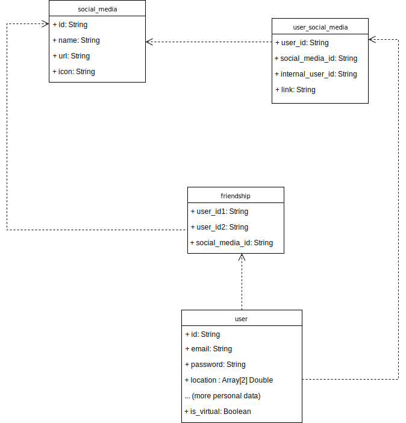

# globize

The goal of the project is to provide users with a single, unified view of all their social media friends.
The user registers on the website, links it to its social media accounts, and the platform scans each of the user's accounts for their friends and provides the user with a single view.

The main issue here is scanning each account for friends. The development to be made is specific to each social media platform.

## Facebook

Before 2014, Facebook Apps were allowed to access a user's complete friends list. The user just had to give the app the `user_friends` permission, and the App could retrieve the user's complete list of friends.
This feature was probably abused by apps which would use this list to invite friends, and Facebook reviewed its policy in 2014 ([ref](https://developers.facebook.com/docs/apps/faq), [ref](https://stackoverflow.com/questions/23417356/facebook-graph-api-v2-0-me-friends-returns-empty-or-only-friends-who-also-u)).

Now, an app is only allowed to retrieve a list of friends who have also installed the App and given it sufficient permissions ([route /user/friends](https://developers.facebook.com/docs/graph-api/reference/user/friends/) in the graph API).

## Twitter

It seems quite straightforward to get a users friend list since it is public information ([get-friends-ids API route](https://developer.twitter.com/en/docs/accounts-and-users/follow-search-get-users/api-reference/get-friends-ids)).
You only need an approved developer account in order to create an App that can generate a [bearer token](https://developer.twitter.com/en/docs/basics/authentication/guides/bearer-tokens).

## Simple UML diagram

## Technical milestones

First, choosing a few (1 or 2) social media platforms to focus on, in order to get a working proof of concept quickly.
Backend (REST API) development: 

- user registration (i.e. inserting into *user*)
- scanning for a list of friends on a specific platform (i.e. updating *friendship*)

